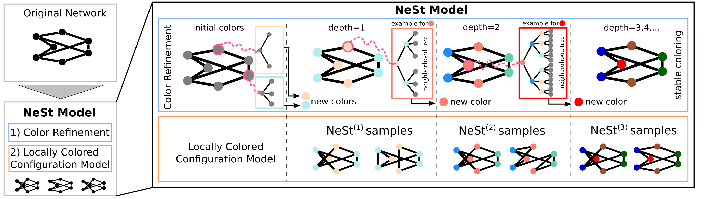

# Neighborhood Structure Configuration Model



Neighborhood Structure Configuration Models (short NeSt-models) allow to generate random graphs that preserved the neighborhood structure of a given graph for arbitrary depth d.

This package provides the implementation as used in our paper.


# Installation instructions
You can install this library like any other python package, depending packages are also installed along with it.


### Installing nestmodel
```
git clone https://github.com/Feelx234/nestmodel.git
pip install nestmodel
```
The installation should take less than a minute.
If you also want to notebooks in the scripts folder please install `jupyter` as outlined below.
```
pip install jupyter
```

### Making sure the installation went smoothly

To make sure the installation has succeeded we need to install pytest as well and then run the tests
```
pip install pytest
python -m pytest nestmodel
```
If you do not have the graph tools library installed, the tests will emit a warning that it is not installed which can be ignored for now.

# Reproducing the results from the paper

Before reproducing the results you need to get the **datasets**. We provide a download script `/scripts/get_datasets.py` which will download all datasets for you.
```
cd nestmodel
python ./scripts/get_datasets.py
```

To reproduce the results from the paper we provided different scripts. The detailed convergence results on HepPh are available in `/scripts/convergence2_example.ipynb`.
This file can be opened in jupyter and should work out of the box.


The convergence results in sum absolute error (SAE) can all be produced by using
```python ./scripts/convergence2_runner.py -all```
The runtime of this script is about 1 day.
The script will first convert the notebook files into `.py` files and then run tests on the karate network which will only take about 1 min.
Once the script is run, plots can be created by opening the `convergence2_plot.ipynb` file in jupyter. The plot file requires the time of completion for the different centrality calculations which can be read of from the result files which appear in `./scripts/results/` and are also stored in a file: `./scripts/convergence2_run_results.txt`.

If you are interested in convergence results for individual centralities you can also checkout any of the `./scripts/convergence2_XXXXX.ipynb` (for example `./scripts/convergence2_pagerank.ipynb`) in jupyter.


The runtime results comparing NeSt with ERGM and Erdös Renyi models can be reproduced using
```python ./scripts/Baselines.ipynb```
Notice that the runtime of the Baselines file for the phonecalls is *several days* because the ERGM is so slow! The baseline results can be visualized in the `./scripts/Baselines_plot.ipynb` notebook.


### System requirements
The package should run on any modern standard computer.


### Software requirements
#### OS Requirements
This package has been tested on *Linux*.

#### Python Dependencies
The package was tested with various version of python (>=3.8). It depends on other packages that are automatically installed along with nestmodel and can be looked up at the setup.py file.
Parts of it also depend on the just-in-time compiler `numba` we used version 0.56.4 but should work on other versions as well.